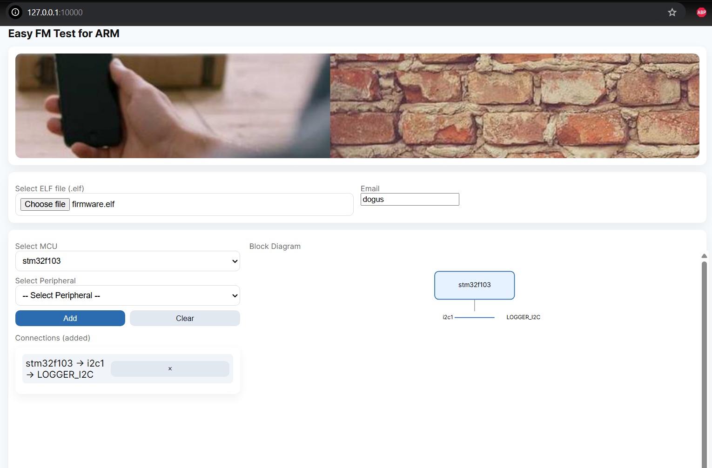

# renode-web

This project is used for creating renode resc and repl with a web UI easily!




## HOW TO

execute

```
python app.py # under web folder
```

and open browser and type the url you saw on logs
then follow the instructions and check the console

## CSONSOLE QUICK TESTS

* renode examples/custom_board/example.resc
* renode examples/custom_can/example.resc
* renode examples/custom_uart_telnet/example.resc
* renode examples/custom_gdb/example.resc
* renode examples/custom_spi_flash_mx25r/example.resc
* renode examples/custom_spi_logger/example.resc
* renode examples/custom_i2c_sensor/example.resc
* renode examples/custom_i2c_logger/example.resc
* renode uploads/example.resc


## LIMITATIONS

* only single sensor can be connected to each peripheral


## TODO

* need to pass I2C slave address via UI, or we are using AA by default
* renode for freertos enabled firmwares


## NOTES

function logging enable

```
sysbus LoadELF @/workspace/uploads/firmware.elf
sysbus.cpu LogFunctionNames true
```
