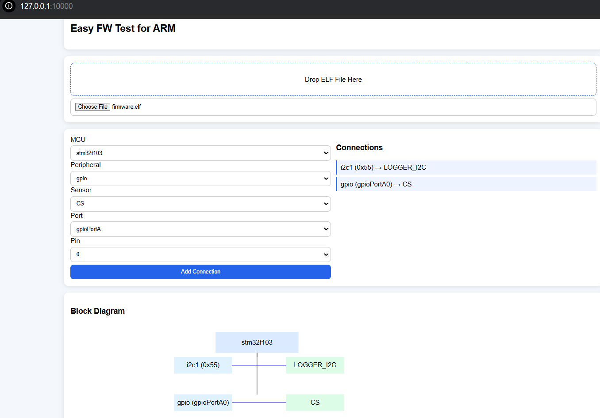

# renode-web

renode-web is a small web UI for creating Renode `.resc` and `.repl` files more easily.



## Usage

The project is now executed through the Makefile.

Run inside Docker:

```bash
make run-in-docker
```

Run inside WSL/native Ubuntu:

```bash
make run-in-wsl
```

The web UI starts a local Flask application. Open the URL printed in the terminal, then follow the UI and console output.

## Adding MCU Support

To add support for a new MCU, place the MCU `.repl` file under:

```text
extendedcpus/
```

Then regenerate the MCU list and start the web UI:

```bash
make update-mcu-list
```

If the MCU dropdown in the web UI looks out of date, run `make update-mcu-list` again before starting the app.

## Limitations

* Only one sensor can be connected to each peripheral.

## Example Report

[Open the PDF](./images/report.pdf)
